

# TEAMFNB420 Shoutout Bot

## Notice

The **fully integrated version** of the TEAMFNB420 Shoutout Bot is exclusively available in the official FNBUBBLES420 Organization Discord server, a registered 501(c)(3) nonprofit. This bot supports **13 major streaming platforms** and is provided **free of charge** to TEAMFNB420 members—no server subscription required. To access the full feature set, please [join our Discord community](https://fnbubbles420.org/discordinvite).
> 

### Supported Streaming Platforms

<table>
	<tr>
		<td align="center"> YouTube</td>
		<td align="center">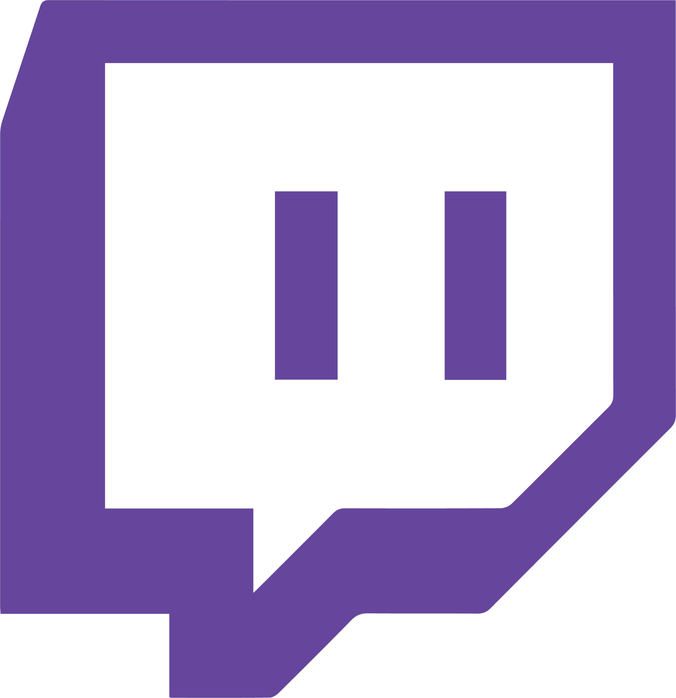 Twitch</td>
		<td align="center">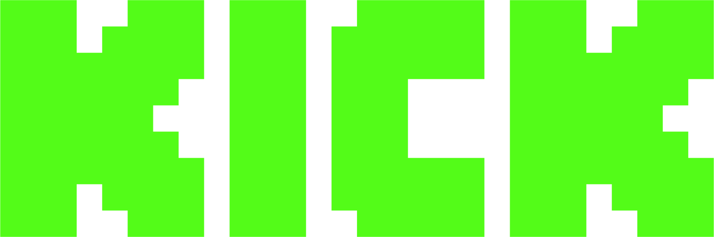 Kick</td>
		<td align="center">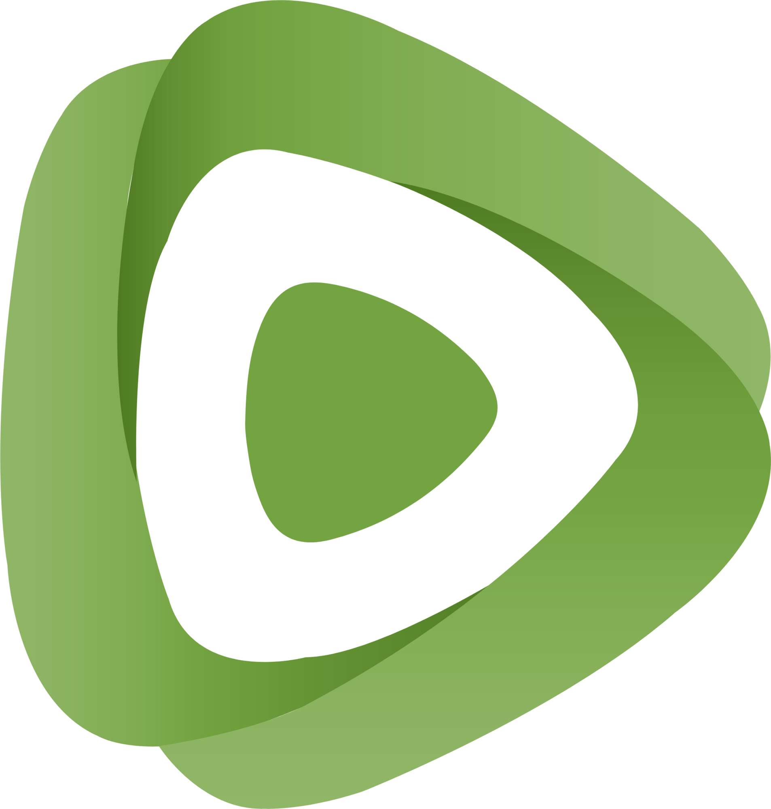 Rumble</td>
	</tr>
	<tr>
		<td align="center"> TikTok</td>
		<td align="center">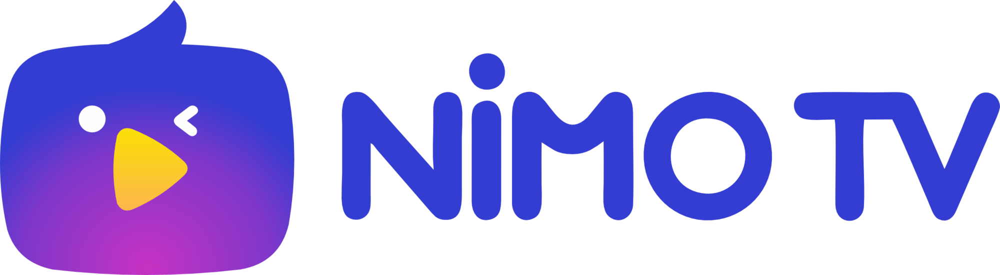 NimoTV</td>
		<td align="center"> Facebook Gaming</td>
		<td align="center">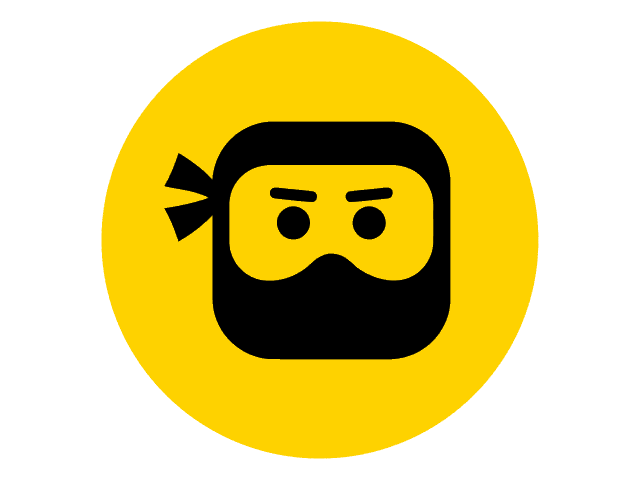 DLive</td>
	</tr>
	<tr>
		<td align="center">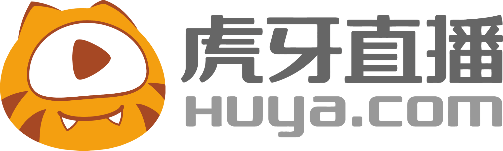 Huya</td>
		<td align="center">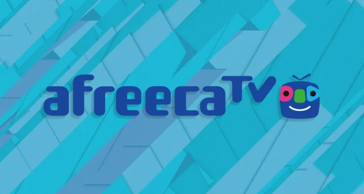 AfreecaTV</td>
		<td align="center">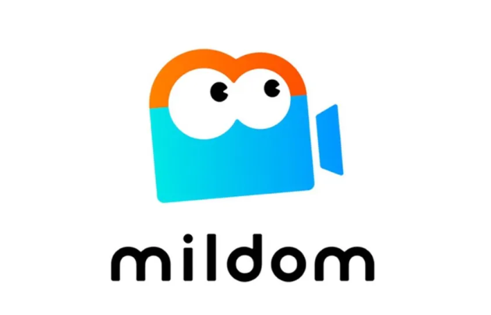 Mildom</td>
		<td align="center">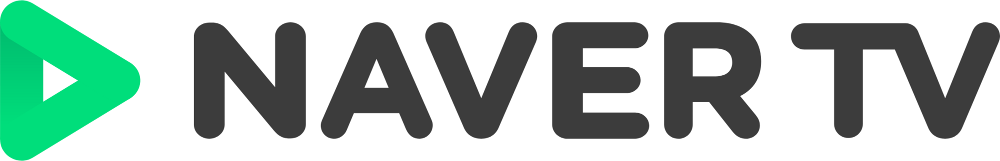 Naver NOW</td>
	</tr>
	<tr>
		<td align="center">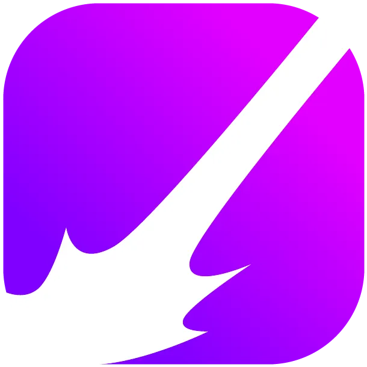 Beam.gg</td>
		<td align="center">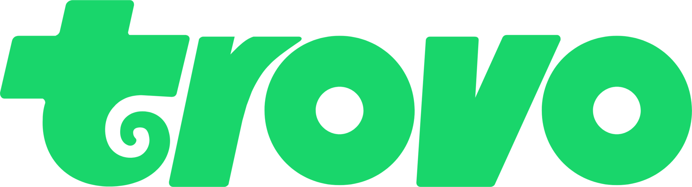 Trovo</td></td>
		<td></td>
		<td></td>
	</tr>
</table>

Availability for other Discord servers is coming soon via a **guild subscription**. Subscriptions will be considered donations (monthly or annual) and will directly support our mission. FNBUBBLES420 Organization is a registered 501(c)(3) nonprofit. Verify us [IRS.GOV](https://apps.irs.gov/app/eos/)

### Our Mission

We are dedicated to empowering disabled individuals, including those with autism, PTSD, mental health challenges, physical disabilities, and service-related injuries. In addition, we actively support streamers, gamers, developers, and veterans.

---

**⭐ If you find this project helpful, please star the repository!**

**Made with ❤️ for the Discord community.**

